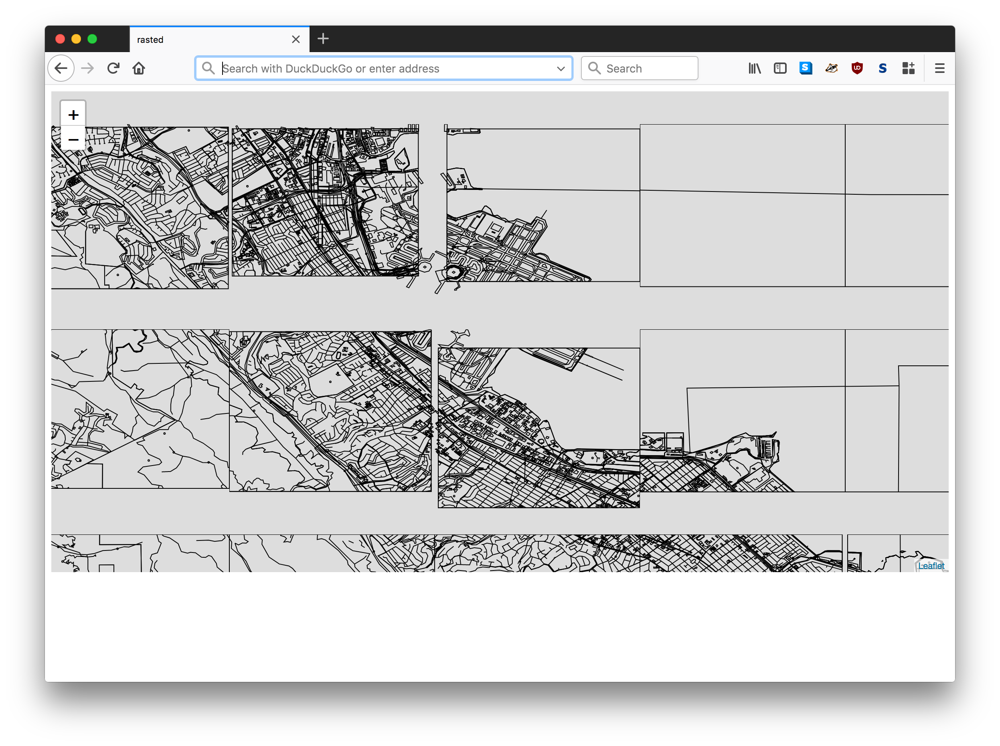
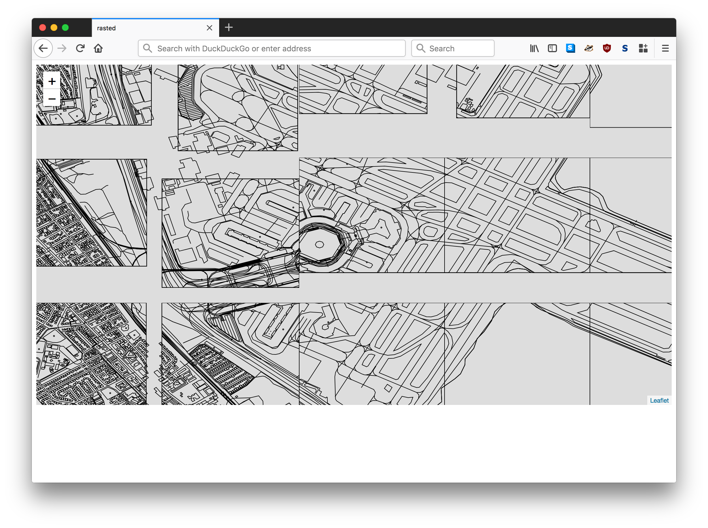

# go-rasterzen

Tools for rendering raster tiles derived from Nextzen (Mapzen) Vector tiles.

## Important

It's way too soon. This is full of bugs and hilarity (see below).

This package uses a two-pass process to convert a Nextzen vector tile to an SVG
document with embedded CSS style information and then to convert that SVG
document to a PNG file. It uses the
[geojson2svg](https://github.com/fapian/geojson2svg) and
[oksvg](https://github.com/srwiley/oksvg) packages respectively to do this.

There is no clipping during the MVT to SVG conversion which results in
the hilarity mentioned above.

It's also not possible to style any of the data beyond black outlines with transparent backgrounds.

Labels... it's easiest just to not even think about them yet.

## Install

You will need to have both `Go` (specifically a version of Go more recent than 1.7 so let's just assume you need [Go 1.9](https://golang.org/dl/) or higher) and the `make` programs installed on your computer. Assuming you do just type:

```
make bin
```

All of this package's dependencies are bundled with the code in the `vendor` directory.

## Example

```
package main

import (
	"flag"
	"github.com/whosonfirst/go-rasterzen/mvt"
	"log"
	"os"
)

func main() {

	flag.Parse()

	for _, path := range flag.Args() {

		fh, _ := os.Open(path)
		defer fh.Close()

		mvt.ToSVG(fh, os.Stdout)
	}
}
```

_Error handling has been removed for the sake of brevity._

## Tools

### rasterd

```
./bin/rasterd -h
Usage of ./bin/rasterd:
  -host string
    	The host for rasterd to listen for requests on (default "localhost")
  -port int
    	The port for rasterd to listen for requests on (default 8080)
```

A simple HTTP server for rasterized Netzen vector tiles. **Remember: this doesn't work yet.**

Specifically:

* MVT tiles are not being cropped properly
* The source MVT tiles are not being cached
* There is no styling beyond block outlines with transparent fills

Like this:






#### Using `rasterd` with Leaflet

```
<html>
  <head>
    <title>rasterd</title>
    
    <link rel="stylesheet" href="https://unpkg.com/leaflet@1.3.1/dist/leaflet.css" integrity="sha512-Rksm5RenBEKSKFjgI3a41vrjkw4EVPlJ3+OiI65vTjIdo9brlAacEuKOiQ5OFh7cOI1bkDwLqdLw3Zg0cRJAAQ==" crossorigin=""/>
    <script src="https://unpkg.com/leaflet@1.3.1/dist/leaflet.js" integrity="sha512-/Nsx9X4HebavoBvEBuyp3I7od5tA0UzAxs+j83KgC8PU0kgB4XiK4Lfe4y4cgBtaRJQEIFCW+oC506aPT2L1zw==" crossorigin=""></script>
    
    <style type="text/css">
      #map { width:100%; height:600px; }
      .leaflet-tile { border: dashed red 1px; }
    </style>
  </head>
  
  <body>
    <div id="map"></div>
    
    <script>
      var api_key = 'NEXTZEN_API_KEY';		// https://developers.nextzen.org/
      var format = 'png';			// you can also request 'svg'

      var map = L.map('map').setView([37.613858, -122.37366], 13);
      var layer = L.tileLayer('http://localhost:8080/' + format + '/{z}/{x}/{y}.svg?api_key=' + api_key, {maxZoom: 16});

      layer.addTo(map);

      var g_layer = L.GeoJSONLayer('http://localhost:8080/' + format + '/{z}/{x}/{y}.svg?api_key=' + api_key, {maxZoom: 16});
      g_layer.addTo(map);
      	  
    </script>
    
  </body>
</html>
```

## See also

* https://github.com/fapian/geojson2svg
* https://github.com/srwiley/oksvg
* https://developers.nextzen.org/
* https://mapzen.com/documentation/vector-tiles/layers/
