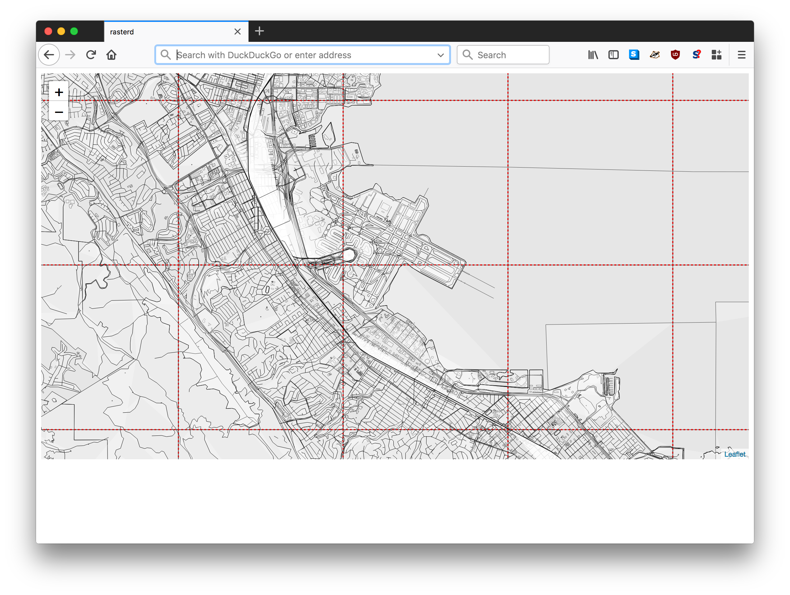

# go-rasterzen

Tools for rendering raster tiles derived from Nextzen (Mapzen) Vector tiles.

## Important

It's way too soon. It works, kind of.

This package uses a two-pass process to convert a Nextzen vector tile to an SVG
document with embedded CSS style information and then to convert that SVG
document to a PNG file. It uses (a patched version of) the
[geojson2svg](https://github.com/whosonfirst/geojson2svg) and
[oksvg](https://github.com/srwiley/oksvg) packages respectively to do this.

Some important caveats:

* It's also not possible to style any of the data beyond black outlines with transparent backgrounds.

* Labels... it's easiest just to not even think about them yet.

* There is no caching yet

## Install

You will need to have both `Go` (specifically a version of Go more recent than 1.7 so let's just assume you need [Go 1.9](https://golang.org/dl/) or higher) and the `make` programs installed on your computer. Assuming you do just type:

```
make bin
```

All of this package's dependencies are bundled with the code in the `vendor` directory.

## Example

```
package main

import (
	"flag"
	"github.com/whosonfirst/go-rasterzen/tile"
	"log"
	"os"
)

func main() {

	flag.Parse()

	for _, path := range flag.Args() {

		fh, _ := os.Open(path)
		defer fh.Close()

		tile.ToSVG(fh, os.Stdout)
	}
}
```

_Error handling has been removed for the sake of brevity._

## Tools

### rasterd

```
./bin/rasterd -h
Usage of ./bin/rasterd:
  -fs-cache
	Cache tiles with a filesystem-based cache.
  -fs-root string
    	   The root of your filesystem cache. If empty rasterd will try to use the current working directory.
  -geojson-handler
	Enable the GeoJSON tile handler.
  -go-cache
	Cache tiles with an in-memory (go-cache) cache.
  -host string
    	The host for rasterd to listen for requests on. (default "localhost")
  -png-handler
	Enable the PNG tile handler. (default true)
  -port int
    	The port for rasterd to listen for requests on. (default 8080)
  -svg-handler
	Enable the SVG tile handler. (default true)
```

A simple HTTP server for delivering rasterized Netzen vector (TMS or "slippy map") tiles.

For example:

```
./bin/rasterd -fs-cache -fs-root ./cache/
```

Would yield something like this:




#### Using `rasterd` with caches

`rasterd` support caching using one or more providers that implement the
[go-whosonfirst-cache](https://github.com/whosonfirst/go-whosonfirst-cache)
`cache.Cache` interface.

Currently filesystem and in-memory (using [go-cache](https://github.com/patrickmn/go-cache)) caches are
supported. You can invoke `rasterd` with multiple cache providers if you want.

Both the raw Nextzen tiles and the cropped "rasterzen" tiles are cached as is
the output of each provider that `rasterd` is invoked with. For example:

```
$> ll ./cache/
total 0
drwxr-xr-x  3 wof  staff  96 Jun 12 12:29 nextzen
drwxr-xr-x  3 wof  staff  96 Jun 12 12:29 png
drwxr-xr-x  3 wof  staff  96 Jun 12 12:29 rasterzen

$> ll ./cache/nextzen/13/*/*.json
-rw-r--r--  1 wof  staff  169188 Jun 12 12:29 ./cache/nextzen/13/1309/3169.json
-rw-r--r--  1 wof  staff  141714 Jun 12 12:29 ./cache/nextzen/13/1309/3170.json
-rw-r--r--  1 wof  staff   52877 Jun 12 12:29 ./cache/nextzen/13/1309/3171.json
-rw-r--r--  1 wof  staff   25104 Jun 12 12:29 ./cache/nextzen/13/1309/3172.json
-rw-r--r--  1 wof  staff  179960 Jun 12 12:29 ./cache/nextzen/13/1310/3169.json
-rw-r--r--  1 wof  staff  241100 Jun 12 12:29 ./cache/nextzen/13/1310/3170.json
-rw-r--r--  1 wof  staff  166356 Jun 12 12:29 ./cache/nextzen/13/1310/3171.json
-rw-r--r--  1 wof  staff   40045 Jun 12 12:29 ./cache/nextzen/13/1310/3172.json
-rw-r--r--  1 wof  staff   45888 Jun 12 12:29 ./cache/nextzen/13/1311/3169.json
-rw-r--r--  1 wof  staff   54786 Jun 12 12:29 ./cache/nextzen/13/1311/3170.json
-rw-r--r--  1 wof  staff  181275 Jun 12 12:29 ./cache/nextzen/13/1311/3171.json
-rw-r--r--  1 wof  staff  116785 Jun 12 12:29 ./cache/nextzen/13/1311/3172.json
-rw-r--r--  1 wof  staff    1449 Jun 12 12:29 ./cache/nextzen/13/1312/3169.json
-rw-r--r--  1 wof  staff    1187 Jun 12 12:29 ./cache/nextzen/13/1312/3170.json
-rw-r--r--  1 wof  staff   75910 Jun 12 12:29 ./cache/nextzen/13/1312/3171.json
-rw-r--r--  1 wof  staff  219538 Jun 12 12:29 ./cache/nextzen/13/1312/3172.json
-rw-r--r--  1 wof  staff    2647 Jun 12 12:29 ./cache/nextzen/13/1313/3169.json
-rw-r--r--  1 wof  staff    1209 Jun 12 12:29 ./cache/nextzen/13/1313/3170.json
-rw-r--r--  1 wof  staff    2793 Jun 12 12:29 ./cache/nextzen/13/1313/3171.json
-rw-r--r--  1 wof  staff  202508 Jun 12 12:29 ./cache/nextzen/13/1313/3172.json
```

#### Using `rasterd` with Leaflet

```
<html>
  <head>
    <title>rasterd</title>
    
    <link rel="stylesheet" href="https://unpkg.com/leaflet@1.3.1/dist/leaflet.css" integrity="sha512-Rksm5RenBEKSKFjgI3a41vrjkw4EVPlJ3+OiI65vTjIdo9brlAacEuKOiQ5OFh7cOI1bkDwLqdLw3Zg0cRJAAQ==" crossorigin=""/>
    <script src="https://unpkg.com/leaflet@1.3.1/dist/leaflet.js" integrity="sha512-/Nsx9X4HebavoBvEBuyp3I7od5tA0UzAxs+j83KgC8PU0kgB4XiK4Lfe4y4cgBtaRJQEIFCW+oC506aPT2L1zw==" crossorigin=""></script>
    
    <style type="text/css">
      #map { width:100%; height:600px; }
      .leaflet-tile { border: dashed red 1px; }
    </style>
  </head>
  
  <body>
    <div id="map"></div>
    
    <script>
      var api_key = 'NEXTZEN_API_KEY';		// https://developers.nextzen.org/
      var format = 'png';			// you can also request 'svg'

      var map = L.map('map').setView([37.613858, -122.37366], 13);
      var layer = L.tileLayer('http://localhost:8080/' + format + '/{z}/{x}/{y}.json?api_key=' + api_key, {maxZoom: 16});

      layer.addTo(map);
      	  
    </script>
    
  </body>
</html>
```

## See also

* https://github.com/fapian/geojson2svg
* https://github.com/srwiley/oksvg
* https://developers.nextzen.org/
* https://mapzen.com/documentation/vector-tiles/layers/
