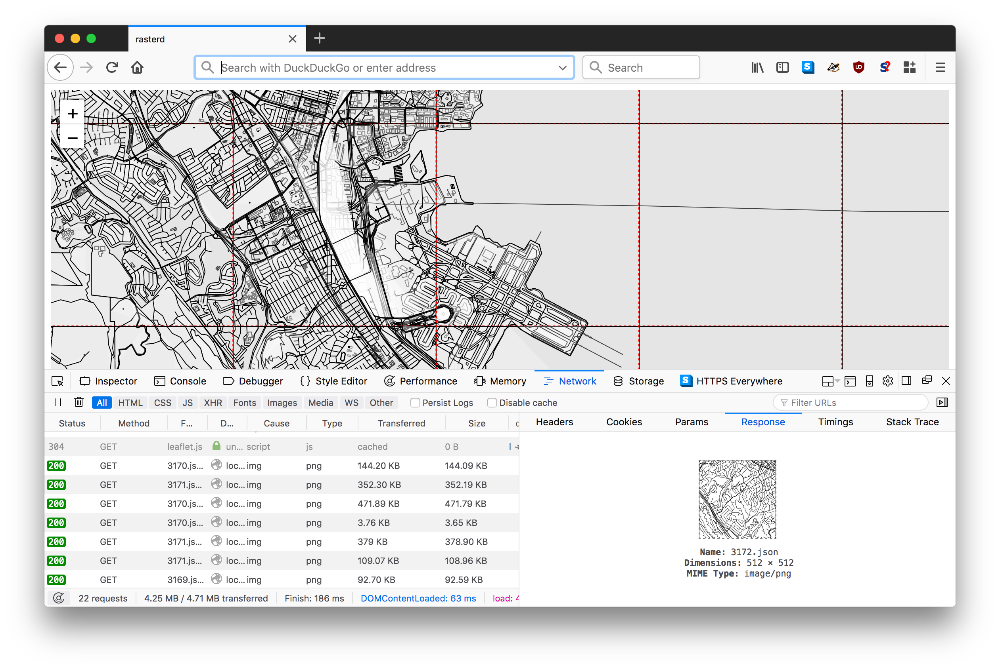
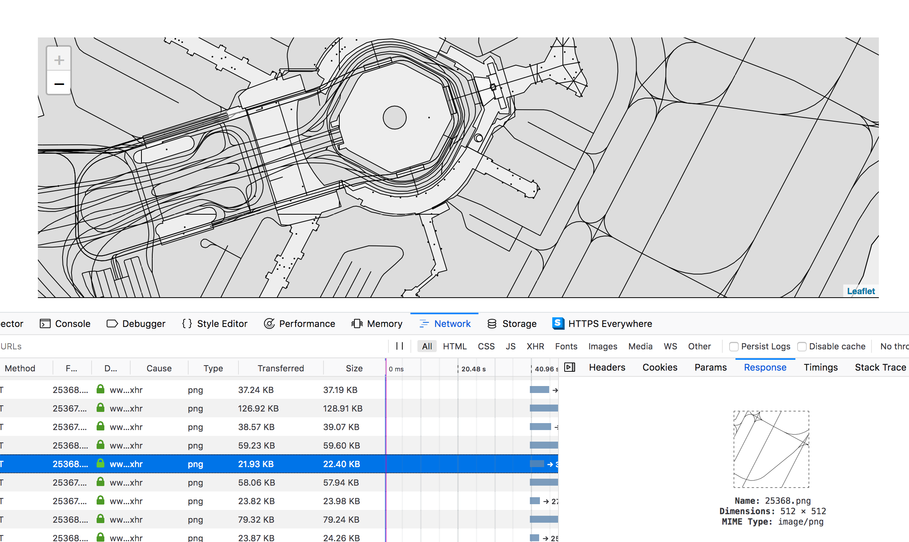

# go-rasterzen


Tools for rendering raster tiles derived from Nextzen (Mapzen) Vector tiles.

## Important

This works... until it doesn't. I wouldn't be surprised if there are bugs.

This package uses a two-pass process to convert a Nextzen vector tile to an SVG
document with embedded CSS style information and then to convert that SVG
document to a PNG file. It uses (a patched version of) the
[geojson2svg](https://github.com/whosonfirst/geojson2svg) and
[oksvg](https://github.com/srwiley/oksvg) packages respectively to do this.

Some important caveats:

* It's also not possible to style any of the data beyond black outlines with transparent backgrounds.

* Labels... it's easiest just to not even think about them yet.

* There is caching but no cache invalidation, yet

## Install

You will need to have both `Go` (specifically a version of Go more recent than 1.7 so let's just assume you need [Go 1.9](https://golang.org/dl/) or higher) and the `make` programs installed on your computer. Assuming you do just type:

```
make bin
```

All of this package's dependencies are bundled with the code in the `vendor` directory.

## Example

```
package main

import (
	"flag"
	"github.com/whosonfirst/go-rasterzen/tile"
	"log"
	"os"
)

func main() {

	flag.Parse()

	for _, path := range flag.Args() {

		fh, _ := os.Open(path)
		defer fh.Close()

		tile.ToSVG(fh, os.Stdout)
	}
}
```

_Error handling has been removed for the sake of brevity._

## Tools

### rasterd

```
$> ./bin/rasterd -h
Usage of ./bin/rasterd:
  -config string
    	Read some or all flags from an ini-style config file. Values in the config file take precedence over command line flags.
  -fs-cache
    	Cache tiles with a filesystem-based cache.
  -fs-root string
    	The root of your filesystem cache. If empty rasterd will try to use the current working directory.
  -geojson-handler
    	Enable the GeoJSON tile handler.
  -go-cache
    	Cache tiles with an in-memory (go-cache) cache.
  -host string
    	The host for rasterd to listen for requests on. (default "localhost")
  -httptest.serve string
    	if non-empty, httptest.NewServer serves on this address and blocks
  -nextzen-apikey string
    	A valid Nextzen API key.
  -nextzen-debug
    	Log requests (to STDOUT) to Nextzen tile servers.
  -nextzen-origin string
    	An optional HTTP 'Origin' host to pass along with your Nextzen requests.
  -nextzen-uri string
    	A valid URI template (RFC 6570) pointing to a custom Nextzen endpoint.
  -no-cache
    	Disable all caching.
  -path-geojson string
    	The path that GeoJSON tiles should be served from (default "/geojson/")
  -path-png string
    	The path that PNG tiles should be served from (default "/png/")
  -path-svg string
    	The path that SVG tiles should be served from (default "/svg/")
  -png-handler
    	Enable the PNG tile handler. (default true)
  -port int
    	The port for rasterd to listen for requests on. (default 8080)
  -protocol string
    	The protocol for wof-staticd server to listen on. Valid protocols are: http, lambda. (default "http")
  -s3-cache
    	Cache tiles with a S3-based cache.
  -s3-dsn string
    	A valid go-whosonfirst-aws DSN string
  -s3-opts string
    	A valid go-whosonfirst-cache-s3 options string
  -section string
    	A valid ini-style config file section. (default "rasterd")
  -svg-handler
    	Enable the SVG tile handler. (default true)
  -www
    	Enable a simple web interface with a slippy map (at /) for testing and debugging.
```

A simple HTTP server for delivering rasterized Netzen vector (TMS or "slippy map") tiles.

For example:

```
./bin/rasterd -fs-cache -fs-root ./cache/
```

Would yield something like this:




#### Using `rasterd` with caches

`rasterd` support caching using one or more providers that implement the
[go-whosonfirst-cache](https://github.com/whosonfirst/go-whosonfirst-cache)
`cache.Cache` interface. Caches are checked (and set) in the following order in `rasterd`: go-cache, fs-cache, s3-cache

There is currently nothing that looks like sophisticated cache invalidation. That's left up to you to do manually, for now. 

Currently filesystem, S3 and in-memory (using [go-cache](https://github.com/patrickmn/go-cache)) caches are
supported. You can invoke `rasterd` with multiple cache providers if you want.

Both the raw Nextzen tiles and the cropped "rasterzen" tiles are cached as is
the output of each provider that `rasterd` is invoked with. For example:

```
$> ll ./cache/
total 0
drwxr-xr-x  3 wof  staff  96 Jun 12 12:29 nextzen
drwxr-xr-x  3 wof  staff  96 Jun 12 12:29 png
drwxr-xr-x  3 wof  staff  96 Jun 12 12:29 rasterzen

$> ll ./cache/nextzen/13/*/*.json
-rw-r--r--  1 wof  staff  169188 Jun 12 12:29 ./cache/nextzen/13/1309/3169.json
-rw-r--r--  1 wof  staff  141714 Jun 12 12:29 ./cache/nextzen/13/1309/3170.json
-rw-r--r--  1 wof  staff   52877 Jun 12 12:29 ./cache/nextzen/13/1309/3171.json
-rw-r--r--  1 wof  staff   25104 Jun 12 12:29 ./cache/nextzen/13/1309/3172.json
-rw-r--r--  1 wof  staff  179960 Jun 12 12:29 ./cache/nextzen/13/1310/3169.json
-rw-r--r--  1 wof  staff  241100 Jun 12 12:29 ./cache/nextzen/13/1310/3170.json
-rw-r--r--  1 wof  staff  166356 Jun 12 12:29 ./cache/nextzen/13/1310/3171.json
-rw-r--r--  1 wof  staff   40045 Jun 12 12:29 ./cache/nextzen/13/1310/3172.json
-rw-r--r--  1 wof  staff   45888 Jun 12 12:29 ./cache/nextzen/13/1311/3169.json
-rw-r--r--  1 wof  staff   54786 Jun 12 12:29 ./cache/nextzen/13/1311/3170.json
-rw-r--r--  1 wof  staff  181275 Jun 12 12:29 ./cache/nextzen/13/1311/3171.json
-rw-r--r--  1 wof  staff  116785 Jun 12 12:29 ./cache/nextzen/13/1311/3172.json
-rw-r--r--  1 wof  staff    1449 Jun 12 12:29 ./cache/nextzen/13/1312/3169.json
-rw-r--r--  1 wof  staff    1187 Jun 12 12:29 ./cache/nextzen/13/1312/3170.json
-rw-r--r--  1 wof  staff   75910 Jun 12 12:29 ./cache/nextzen/13/1312/3171.json
-rw-r--r--  1 wof  staff  219538 Jun 12 12:29 ./cache/nextzen/13/1312/3172.json
-rw-r--r--  1 wof  staff    2647 Jun 12 12:29 ./cache/nextzen/13/1313/3169.json
-rw-r--r--  1 wof  staff    1209 Jun 12 12:29 ./cache/nextzen/13/1313/3170.json
-rw-r--r--  1 wof  staff    2793 Jun 12 12:29 ./cache/nextzen/13/1313/3171.json
-rw-r--r--  1 wof  staff  202508 Jun 12 12:29 ./cache/nextzen/13/1313/3172.json
```

### rasterzen-seed

Pre-seed one or more rasterzen tiles (and their SVG or PNG derivatives).

```
./bin/rasterzen-seed -h
Usage of ./bin/rasterzen-seed:
  -extent value
    	One or more extents to fetch tiles for. Extents should be passed as comma-separated 'minx,miny,maxx,maxy' strings.
  -fs-cache
    	Cache tiles with a filesystem-based cache.
  -fs-root string
    	The root of your filesystem cache. If empty rasterd will try to use the current working directory.
  -go-cache
    	Cache tiles with an in-memory (go-cache) cache.
  -lambda-dsn value
    	A valid go-whosonfirst-aws DSN string. Required paremeters are 'credentials=CREDENTIALS' and 'region=REGION'
  -lambda-function string
    	A valid AWS Lambda function name. (default "Rasterzen")
  -max-zoom int
    	The maximum zoom level to fetch for a tile extent. (default 16)
  -min-zoom int
    	The minimum zoom level to fetch for a tile extent. (default 1)
  -mode string
    	The mode to use when calculating tiles. Valid modes are: extent, tiles. (default "tiles")
  -nextzen-apikey string
    	A valid Nextzen API key.
  -nextzen-debug
    	Log requests (to STDOUT) to Nextzen tile servers.
  -nextzen-origin string
    	An optional HTTP 'Origin' host to pass along with your Nextzen requests.
  -nextzen-uri string
    	A valid URI template (RFC 6570) pointing to a custom Nextzen endpoint.
  -s3-cache
    	Cache tiles with a S3-based cache.
  -s3-dsn string
    	A valid go-whosonfirst-aws DSN string
  -s3-opts string
    	A valid go-whosonfirst-cache-s3 options string
  -seed-all
    	See all the tile formats
  -seed-max-workers int
    	The maximum number of concurrent workers to invoke when seeding tiles (default 100)
  -seed-png
    	Seed PNG tiles.
  -seed-rasterzen
    	Seed Rasterzen tiles.
  -seed-svg
    	Seed SVG tiles.
  -seed-worker string
    	The type of worker for seeding tiles. Valid workers are: lambda, local. (default "local")
  -timings
    	Display timings for tile seeding.
```

For example:

```
$> ./bin/rasterzen-seed -fs-cache -fs-root cache -nextzen-apikey {NEXTZEN_APIKEY} -mode extent -extent '-73.9475518701 45.4145906777 -73.4761975429 45.7037982616' -zoom 10 -zoom 11 -zoom 12 -seed-png
2018/11/01 12:35:27 enable filesystem cache layer
2018/11/01 12:35:27 BUNK GEOMETRY (collect)
2018/11/01 12:35:27 BUNK GEOMETRY (process)
2018/11/01 12:36:22 OK {10 303 365}
2018/11/01 12:36:28 OK {12 1206 1462}
2018/11/01 12:36:29 OK {12 1206 1463}
...and so on
```

Or, if you've deployed `rasterd` as a AWS Lambda function (see below) you can use that function as your tile seed "worker". For example:

```
$> ./bin/rasterzen-seed -mode extent -extent '-122.405228 37.604481 -122.355044 37.645194' -min-zoom 2 -max-zoom 16 -nextzen-apikey {NEXTZEN_APIKEY} -seed-worker lambda -lambda-function {LAMBDA_FUNCTION} -lambda-dsn 'credentials={AWS_CREDENTIALS} region={AWS_REGION}' -seed-png
15:50:58.758870 [rasterzen-seed] STATUS Time to seed tile ({16 10489 25361}) 948.46835ms
15:50:58.802463 [rasterzen-seed] STATUS Time to seed tile ({16 10488 25364}) 1.600181332s
15:50:58.802491 [rasterzen-seed] STATUS Time to seed tile ({16 10490 25369}) 1.605183373s
15:50:58.802499 [rasterzen-seed] STATUS Time to seed tile ({16 10485 25362}) 1.604714453s
15:50:58.802506 [rasterzen-seed] STATUS Time to seed tile ({16 10490 25368}) 1.598768809s
15:50:58.987440 [rasterzen-seed] STATUS Time to seed tile ({16 10484 25364}) 4.284314644s
15:50:59.010505 [rasterzen-seed] STATUS Time to seed tile ({15 5246 12684}) 4.306041647s
15:50:59.010518 [rasterzen-seed] STATUS Time to seed tile ({15 5242 12685}) 1.222798064s
... and so on
```

Note that in the example above we haven't specified any local caching sources, as we did in the first example, so tiles will be rendered in AWS and cached (or not) depending on how your Lambda function is configured.

Essentially what the second example is doing is pre-seeding an S3 cache which might be something you'd want to do if you want to serve `PNG` tiles but a) don't want to suffer what the (sometimes very long) wait times generating raster tiles or b) don't want to deal with the hoop-jumping around images and AWS Lambda / API Gateway integrations (see below).

## Lambda

Yes, it is possible to run `rasterd` as an AWS Lambda function.

To create the Lambda function you're going to upload to AWS simply use the handy `lambda` target in the Makefile. This will create a file called `deployment.zip` which you will need to upload to AWS (those details are out of scope for this document).

Your `wof-staticd` function should be configured with (Lambda) environment variables. Environment variables map to the standard command line flags as follows:

* The command line flag is upper-cased
* All instances of `-` are replaced with `_`
* Each flag is prefixed with `RASTERD`

For example the command line flag `-protocol` would be mapped to the `RASTERD_PROTOCOL` environment variable. Which is a good example because it is the one environment variable you _must_ to specify for `rasterd` to work as a Lambda function. Specifically you need to define the protocol as... "lambda". For example

```
RASTERD_PROTOCOL = lambda
```

In reality you'll need to specify other flags, like `RASTERD_S3_DSN` and `RASTERD_CACHE_OPTIONS`. For example here's how you might configure your function to render all the data and graphics formats (but not static HTML webpages) for your data:

```
RASTERD_PROTOCOL = lambda
RASTERD_S3_CACHE = true
RASTERD_S3_OPTS = ACL=public-read
RASTERD_S3_DSN = bucket={BUCKET} prefix={PREFIX} region={REGION} credentials=iam:
```

### Lambda, API Gateway and images

In order for requests to produce PNG output (rather than a base64 encoded string) you will need to do a few things.

1. Make sure your API Gateway settings list `image/png` as a known and valid binary type:


2. If you've put a CloudFront distribution in front of your API Gateway then you
will to ensure that you blanket enable all HTTP headers or whitelist the
`Accept:` header , via the `Cache Based on Selected Request Headers` option (for
the CloudFront behaviour that points to your gateway):


3. Make sure you pass an `Accept: image/png` header when you request the PNG rendering.

4. If you add another image (or binary) handler to this package you'll need to
repeat steps 1-3 _and_ update the `BinaryContentTypes` dictionary in
[server/lambda.go](server/lambda.go) code accordingly. Good times...

#### Lambda, API Gateway and images... and Leaflet



The good news is that it works. You can use PNG tiles produced by `rasterd`
inside a normal [Leaflet](https://leafletjs.com/) `Tile` layer. The bad news is
that you need to use the bundled
[L.TileLayer.Lambdazen.js](javascript/L.TileLayer.Lambdazen.js) 
package (or equivalent) to do so, like this: 

```
// <script type="text/javascript" src="L.TileLayer.Lambdazen.js"></script>
	
var url = 'https://{SOME-LAMBDA-API-GATEWAY-URL}/png/{z}/{x}/{y}.png?api_key={API_KEY}';
var layer = new L.TileLayer.Lambdazen(url, { maxZoom: 16 });
	
var map = L.map('map').setView([37.613858, -122.37366], 15);
layer.addTo(map);
```

This [redefines the default `createTile`
method](https://leafletjs.com/examples/extending/extending-2-layers.html) to
fetch the tile in question with the correct `Accept:` header discussed above and
then hands the resulting image back to Leaflet. Computers, right... ?

## Docker

Not yet.

## Nextzen options

### URI Templates

The default Nextzen URI template looks like this:

```
https://tile.nextzen.org/tilezen/vector/v1/256/{layer}/{z}/{x}/{y}.json?api_key={apikey}
```

## See also

* https://github.com/fapian/geojson2svg
* https://github.com/srwiley/oksvg
* https://developers.nextzen.org/
* https://mapzen.com/documentation/vector-tiles/layers/